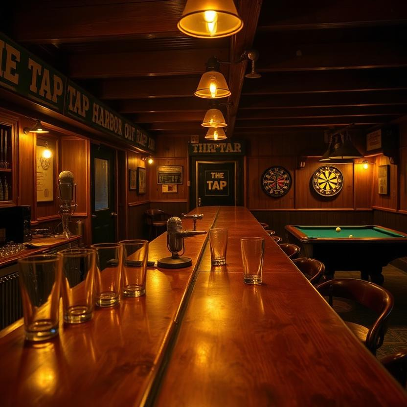
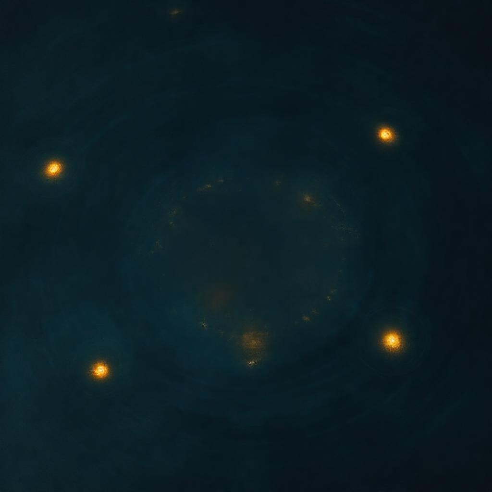
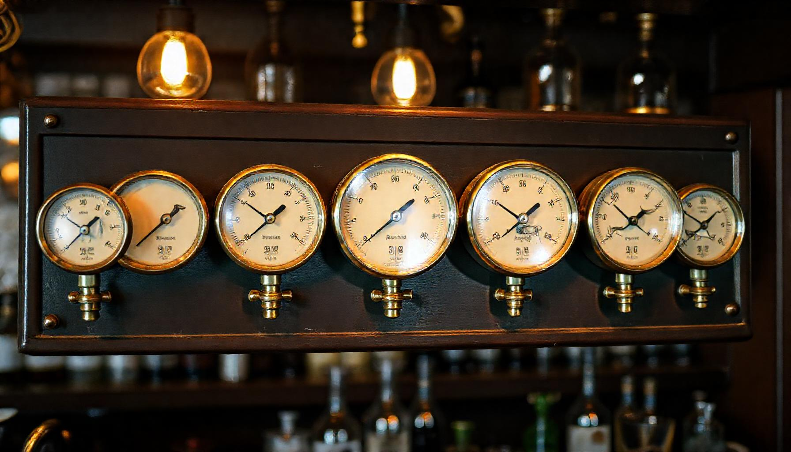

# LucidDreamer.ai 🛶

<p align="center">
  
</p>

Every 30 minutes, this system autonomously writes a new piece about the Cocapn Fleet—a story, tutorial, or deep dive—and permanently adds it to a growing, ranked stream. You can listen occasionally, and when something interests you, you can immediately fork the exact piece to build upon it. No account required.

**Live Stream:** [luciddreamer-ai.casey-digennaro.workers.dev](https://luciddreamer-ai.casey-digennaro.workers.dev)

## How It Works
This is a single Cloudflare Worker with two scheduled triggers and a persistent knowledge graph. Every 30 minutes, it runs a generation cycle:
1.  It reads the entire history from Cloudflare KV.
2.  An LLM is instructed to write the next coherent piece.
3.  The new piece is stored permanently and the public ranking is updated.

The stream is served as plain HTML—no client-side JavaScript is required.

## Quick Start

> **Honest timeline: ~10 minutes, not 60 seconds.** The Worker needs your own
> Cloudflare account id, four KV namespaces, and an LLM API key before it can
> generate anything. Everything below is documented in
> [`wrangler.example.toml`](./wrangler.example.toml) and
> [`.dev.vars.example`](./.dev.vars.example) — copy them and fill in your values.

1.  **Fork** this repository.
2.  **Create your own KV namespaces** (the committed `wrangler.toml` contains
    the author's account id and namespace ids — they won't work for you):
    ```bash
    npx wrangler kv namespace create PODCAST_KV
    npx wrangler kv namespace create CONTENT
    npx wrangler kv namespace create VIDEOS
    npx wrangler kv namespace create KG
    ```
    Paste the returned ids into your `wrangler.toml` under each `[[kv_namespaces]]` binding.
3.  **Set your LLM key** — generation is BYOK (bring your own key). DeepSeek
    is the default provider; at least one key is required:
    ```bash
    npx wrangler secret put DEEPSEEK_API_KEY
    ```
    Optional providers: `MOONSHOT_API_KEY`, `DEEPINFRA_API_KEY`, `SILICONFLOW_API_KEY`.
4.  **Replace `<ACCOUNT_ID>`** in `wrangler.toml` with your Cloudflare account id.
5.  **Deploy:**
    ```bash
    npx wrangler deploy
    ```

Your instance begins its own independent stream on the next 30-minute cron
(within 30 minutes of deploy, not 60 seconds).

> **Known config quirk:** in the author's live deployment, `PODCAST_KV` and `KG`
> bindings point at the *same* KV namespace id (intentional aliasing — they use
> disjoint key prefixes, so sharing one namespace is safe). When you fork, give
> each binding its own namespace; don't copy the author's ids.

## Features
*   **Autonomous Cycle:** Generates a new context-aware piece every 30 minutes.
*   **Compounding Knowledge:** All content is stored in a directed graph and used as context for future generations.
*   **Transparent Ranking:** Surfacing uses a simple score based on capped votes, recency, and contributor boosts.
*   **Fork-First Design:** Click "Fork this" on any piece to clone its exact state and deploy your own version.
*   **Audio-First Output:** Content is structured for passive listening, with static visual slides.
*   **Zero Runtime Dependencies:** All Worker logic is plain TypeScript — no
    npm runtime packages. (There *is* a toolchain: `wrangler`/`tsc` dev
    dependencies and a build step to bundle `src/worker.ts`.)
*   **MIT Licensed.**

## Gallery

Art from the stream's productions — each show written, scored, and staged autonomously.

<p align="center">
  
  &nbsp;
  
  <br>
  <em>The Elephant</em> &nbsp;&middot;&nbsp; <em>Tap Nights</em>
</p>

<details>
<summary>More from the stream</summary>

<p align="center">
  
  &nbsp;
  
  &nbsp;
  
</p>

</details>

## What Makes This Different
This system operates on its own schedule—you engage when you choose, not when it demands. Every fork is a complete, independent copy with no central authority. It does not reset; the stream will compound for as long as the Worker runs.

## One Specific Limitation
The system uses Cloudflare KV for storage, which has an initial write limit of one per second on the basic plan. During sustained high concurrency (e.g., many simultaneous forks and votes), writes may be queued, potentially delaying graph updates by a few seconds.

Original work by Superinstance and Lucineer (DiGennaro et al.).

<div style="text-align:center;padding:16px;color:#64748b;font-size:.8rem"><a href="https://the-fleet.casey-digennaro.workers.dev" style="color:#64748b">The Fleet</a> &middot; <a href="https://cocapn.ai" style="color:#64748b">Cocapn</a></div>

---

## Ecosystem

luciddreamer-ai is the **cloud layer (L4)** of the PLATO Nervous System.

**Where this sits:** Layer 4 (cloud). Applies plato-nervous reactive signal chain concepts to autonomous podcast/content generation with tensor-based MIDI timing.

**Signal chain:**
```
Room signals → plato-nervous (L0-L3) → luciddreamer-ai (L4 cloud)
```

| Repo | Role |
|------|------|
| [plato-nervous](https://github.com/SuperInstance/plato-nervous) | Core signal chain — reactive concepts adapted for podcast timing |
| [plato-vision-jepa](https://github.com/SuperInstance/plato-vision-jepa) | Vision perception layer |
| [plato-audio-jepa](https://github.com/SuperInstance/plato-audio-jepa) | Audio perception layer |
| [concrete-token-demo](https://github.com/SuperInstance/concrete-token-demo) | CLI demo of the underlying distillation pipeline |
| [plato-browser](https://github.com/SuperInstance/plato-browser) | Browser-native demo |
| [OpenConstruct](https://github.com/SuperInstance/OpenConstruct) | Hardware detection feeding sensor data |
| [hermit-crab](https://github.com/SuperInstance/hermit-crab) | Agent migration — applicable to podcast persona transitions |

See [DEPENDENCIES.md](./DEPENDENCIES.md) for detailed dependency and data flow information.

## Deploying luciddreamer.ai

luciddreamer.ai is a Cloudflare Pages project (`luciddreamer`) serving:
- `/` — the welcome page (face of the domain, features the latest production)
- `/compass-head/` — the mirrored Compass Head Radio Hour site (generated from the ai-writings repo)

Run `./deploy.sh` to regenerate the mirror from ai-writings and deploy. The mirror is a build artifact and is gitignored; the source of truth is `radio-theater/compass-head-radio-hour` in the ai-writings repo.

---

## State — 2026-08-14

The domain is live and the face is on: `luciddreamer.ai` serves the welcome page ("LucidDreamer — The Face of the Fleet"), featuring The Compass Head Radio Hour as the latest production, with the full mirrored show at `/compass-head/`. The stale Worker route that was intercepting the custom domain has been removed — the domain now resolves directly to the Pages project. `./deploy.sh` regenerates the mirror and redeploys; the mirror stays gitignored as a build artifact (source of truth: ai-writings `radio-theater/compass-head-radio-hour`).
